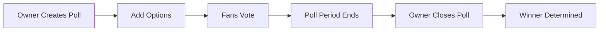

# 🗳️ FanVote - Fan Voting & Governance Platform

A decentralized voting platform built on Stacks blockchain that empowers fans to participate in team decisions including uniform designs, charity initiatives, events, and general governance matters.

## ✨ Features

- 🎨 **Multiple Proposal Types**: Support for uniform designs, charity initiatives, events, and general governance
- ⏰ **Time-based Voting**: Configurable voting periods with automatic expiration
- 🔒 **Secure Voting**: One vote per user with tamper-proof blockchain storage
- 👑 **Admin Controls**: Administrative functions for proposal management
- 📊 **Real-time Results**: Live vote counting and winner calculation
- 📈 **Voter Statistics**: Track participation and engagement metrics
- 🏆 **Result Finalization**: Official result recording with timestamps

## 🚀 Quick Start

### Prerequisites
- [Clarinet](https://github.com/hirosystems/clarinet) installed
- Stacks wallet for interaction
- Basic understanding of Clarity smart contracts

### Installation

1. Clone the repository:
```bash
git clone <repository-url>
cd Fan-Voting---Governance
```

2. Install dependencies:
```bash
npm install
```

3. Check contract compilation:
```bash
clarinet check
```

## 🎯 Usage Guide

### Creating a Proposal

Use the `create-proposal` function to create new voting proposals:

```clarity
(contract-call? .FanVote create-proposal
  "New Team Uniform Design"
  "Vote for your favorite uniform design for next season"
  u1  ;; PROPOSAL_TYPE_UNIFORM
  u1440  ;; Duration in blocks (~10 days)
  "Classic Blue Design"
  "Modern Red Design"
  "Retro Green Design"
  "Limited Gold Edition")
```

### Voting on Proposals

Fans can vote using the `vote` function:

```clarity
(contract-call? .FanVote vote u1 u2)  ;; Vote for option 2 on proposal 1
```

### Checking Results

View proposal status and results:

```clarity
;; Get proposal details
(contract-call? .FanVote get-proposal u1)

;; Check if proposal is active
(contract-call? .FanVote is-proposal-active u1)

;; Get voting results
(contract-call? .FanVote get-proposal-result u1)
```

## 📋 Proposal Types

| Type | ID | Description |
|------|----|--------------|
| 🎽 Uniform | `u1` | Team uniform designs and variations |
| 💝 Charity | `u2` | Charitable initiatives and donations |
| 🎉 Event | `u3` | Fan events and community activities |
| 🏛️ General | `u4` | General governance and team decisions |

## ⚙️ Administrative Functions

### Setting New Admin
```clarity
(contract-call? .FanVote set-admin 'SP2NEW-ADMIN-ADDRESS)
```

### Finalizing Proposals
```clarity
(contract-call? .FanVote finalize-proposal u1)
```

### Extending Voting Period
```clarity
(contract-call? .FanVote extend-proposal u1 u144)  ;; Add 1 day
```

### Canceling Proposals
```clarity
(contract-call? .FanVote cancel-proposal u1)
```

## 🔍 Query Functions

### Proposal Information
- `get-proposal(proposal-id)` - Get complete proposal details
- `get-proposal-count()` - Total number of proposals created
- `get-proposal-status(proposal-id)` - Current status (0=cancelled, 1=pending, 2=active, 3=ended)
- `is-proposal-active(proposal-id)` - Check if voting is currently open

### Voting Information
- `get-vote(proposal-id, voter)` - Get user's vote for a proposal
- `has-user-voted(proposal-id, user)` - Check if user has already voted
- `get-voter-stats(voter)` - Get user's participation statistics

### Results
- `get-proposal-option(proposal-id, option-id)` - Get option details and vote count
- `calculate-winning-option(proposal-id)` - Calculate current leading option
- `get-proposal-result(proposal-id)` - Get finalized results

## 🏗️ Contract Architecture

### Data Maps
- **proposals**: Core proposal information
- **proposal-options**: Individual voting options (up to 4 per proposal)
- **votes**: Individual vote records
- **voter-participation**: User engagement statistics
- **proposal-results**: Finalized voting outcomes

### Key Constants
- `MIN_VOTING_DURATION`: 144 blocks (~1 day)
- `MAX_VOTING_DURATION`: 4320 blocks (~30 days)
- Proposal types: UNIFORM(1), CHARITY(2), EVENT(3), GENERAL(4)

## 🛡️ Security Features

- ✅ **Single Vote Prevention**: Users can only vote once per proposal
- ✅ **Time Validation**: Voting only allowed during active periods
- ✅ **Admin Authorization**: Critical functions require admin privileges
- ✅ **Input Validation**: Proper validation of all parameters
- ✅ **Status Checks**: Comprehensive proposal state management

## 🧪 Testing

Run the test suite:

```bash
npm test
```

For specific test files:

```bash
npm test FanVote.test.ts
```

## 📊 Example Scenarios

### Uniform Design Vote
1. Team creates proposal for new uniform designs
2. Fans vote on their preferred option over 7 days
3. Admin finalizes results
4. Winning design is implemented

### Charity Initiative
1. Proposal created for charity partnership
2. Community votes on preferred charity
3. Results determine team's charitable focus

### Fan Event Planning
1. Multiple event options proposed
2. Season ticket holders vote
3. Most popular event gets organized

## 🤝 Contributing

1. Fork the repository
2. Create a feature branch
3. Make your changes
4. Add tests for new functionality
5. Submit a pull request

## 📄 License

This project is open source and available under the [MIT License](LICENSE).

## 🔗 Links

- [Stacks Blockchain](https://stacks.co/)
- [Clarity Language](https://clarity-lang.org/)
- [Clarinet Documentation](https://docs.hiro.so/clarinet/)

---

**Made with ❤️ for the fan community**

# FanVote 🗳️ - Fan Voting & Governance Platform

[](#)
[](#)
[](#)

> A blockchain-powered platform that empowers fans to vote on team decisions, from uniform designs to charity initiatives! ⚽️👕

## 🎯 Overview

FanVote is a decentralized smart contract built on the Stacks blockchain that enables sports teams, clubs, and organizations to create transparent, tamper-proof voting systems for fan engagement. Whether you're choosing new team uniforms, selecting charity partners, or making other fan-driven decisions, FanVote ensures every voice is heard! 🎉

## ✨ Key Features

- 🔐 **Secure Voting**: Each fan can vote only once per poll
- ⏰ **Time-Bounded Polls**: Set start and end blocks for voting periods
- 🎭 **Multiple Options**: Support for up to 10 voting options per poll
- 👑 **Owner Management**: Contract owner controls poll creation and management
- 📊 **Real-time Results**: Transparent vote counting and winner determination
- 📝 **Event Logging**: All actions are logged for auditability
- 🏆 **Winner Detection**: Automatic determination of winning options

## 🚀 Quick Start

### Prerequisites

- [Clarinet](https://docs.hiro.so/stacks/clarinet) installed
- [Node.js](https://nodejs.org/) (for testing)
- Basic understanding of Stacks and Clarity

### Installation

```bash
# Clone the repository
git clone <repository-url>
cd Fan-Voting---Governance

# Install dependencies
npm install

# Check contract syntax
clarinet check
```

## 📋 Usage Examples

### 1. Creating a Poll 🗳️

```clarity
;; Owner creates a new poll for uniform selection
(contract-call? .FanVote create-poll 
  "New Team Uniform Design" 
  "Help us choose the design for our 2025 season uniforms!" 
  u1440) ;; Poll duration: 1440 blocks (~10 days)
```

### 2. Adding Voting Options 📝

```clarity
;; Add multiple options to the poll
(contract-call? .FanVote add-option u1 "Classic Blue with Gold Stripes")
(contract-call? .FanVote add-option u1 "Modern Black with Silver Accents")
(contract-call? .FanVote add-option u1 "Retro Green with White Details")
```

### 3. Voting 🎯

```clarity
;; Fan votes for their preferred option
(contract-call? .FanVote vote u1 u2) ;; Vote for option 2 in poll 1
```

### 4. Closing Poll & Getting Results 🏆

```clarity
;; Owner closes the poll after voting period ends
(contract-call? .FanVote close-poll u1)

;; Check the winner
(contract-call? .FanVote get-poll u1)
```

## 🔍 Contract Functions

### Public Functions

| Function | Description | Access |
|----------|-------------|--------|
| `initialize(new-owner)` | Change contract ownership | Owner Only |
| `create-poll(title, description, duration)` | Create a new voting poll | Owner Only |
| `add-option(poll-id, description)` | Add voting option to poll | Owner Only |
| `vote(poll-id, option-id)` | Cast a vote for an option | Public |
| `close-poll(poll-id)` | Close poll and determine winner | Owner Only |

### Read-Only Functions

| Function | Description | Returns |
|----------|-------------|----------|
| `get-poll(poll-id)` | Get poll details | Poll object |
| `get-option(poll-id, option-id)` | Get option details | Option object |
| `get-user-vote(poll-id, voter)` | Check user's vote | Option ID |
| `has-voted(poll-id, voter)` | Check if user has voted | Boolean |
| `is-poll-active(poll-id)` | Check if poll is active | Boolean |
| `get-poll-count()` | Get total number of polls | Number |

## 🧪 Testing

```bash
# Run all tests
npm test

# Run specific test file
npm test -- --testNamePattern="FanVote"

# Check contract syntax
clarinet check
```

## 🏗️ Deployment

### Local Development

```bash
# Start Clarinet console
clarinet console

# Deploy contract in console
::deploy_contracts
```

### Testnet Deployment

```bash
# Deploy to testnet
clarinet deployments apply --devnet
```

### Mainnet Deployment

```bash
# Deploy to mainnet (use with caution!)
clarinet deployments apply --mainnet
```

## 📊 Example Workflow



## 🔐 Security Considerations

- ✅ **Single Vote Per User**: Each principal can only vote once per poll
- ✅ **Time-Bound Voting**: Polls have defined start and end blocks
- ✅ **Owner-Only Management**: Critical functions restricted to contract owner
- ✅ **Input Validation**: All inputs are validated for correctness
- ⚠️ **Note**: Contract owner has significant control - consider multi-sig for production

## 🛣️ Roadmap & Future Improvements

- 🔄 **Multi-Sig Governance**: Implement multi-signature requirements for critical actions
- 🪙 **Token-Weighted Voting**: Enable voting power based on token holdings
- 📱 **Web Interface**: Build user-friendly frontend for poll interaction
- 🔗 **NFT Integration**: Use NFTs for voting eligibility verification
- 📈 **Analytics Dashboard**: Comprehensive voting analytics and insights
- 🌐 **Cross-Chain Support**: Expand to other blockchain networks

## 💡 Use Cases

- 🎽 **Sports Teams**: Uniform designs, mascot selection, stadium features
- 🎮 **Gaming Communities**: Character designs, game features, tournament formats
- 🏢 **Organizations**: Logo designs, charity partnerships, event planning
- 🎵 **Entertainment**: Concert setlists, merchandise designs, tour locations

## 📄 License

This project is licensed under the MIT License - see the [LICENSE](LICENSE) file for details.

## 🤝 Contributing

Contributions are welcome! Please feel free to submit a Pull Request. For major changes, please open an issue first to discuss what you would like to change.

## 📞 Support

Have questions or need help? Feel free to:
- 📧 Open an issue on GitHub
- 💬 Join our community discussions
- 📚 Check out the [Stacks Documentation](https://docs.stacks.co/)

---

**Made with ❤️ for the Stacks ecosystem**

